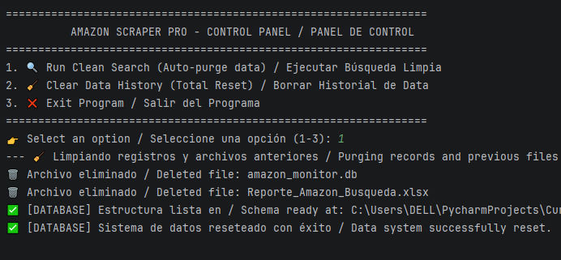
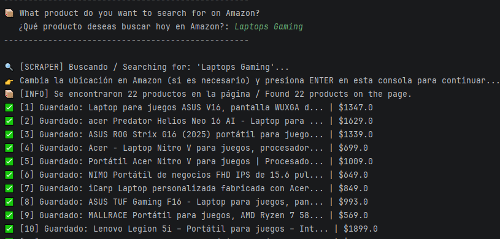
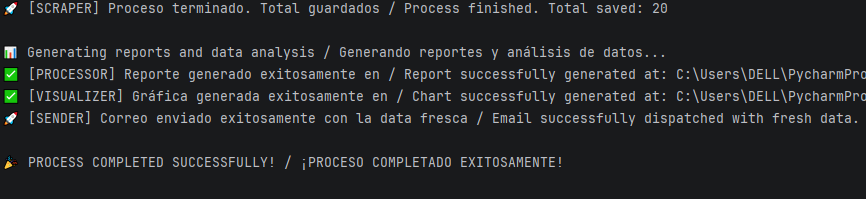
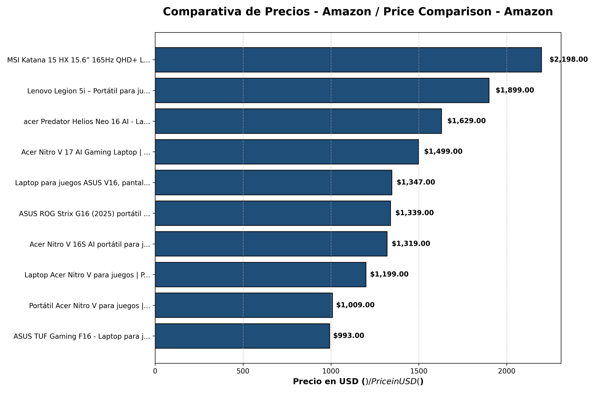
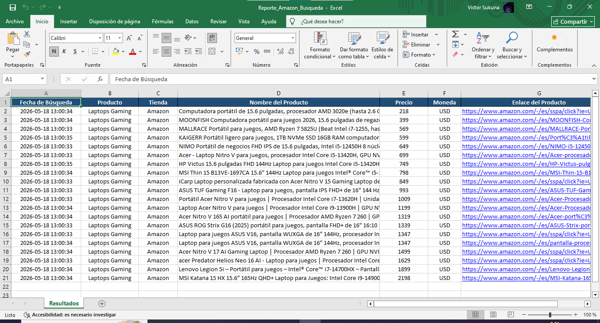

# 📊 Amazon Scraper Pro

  <a href="#-español">🇪🇸 Español</a> | <a href="#-english">🇺🇸 English</a> 

---

## 🇪🇸 Español

### 📌 Descripción
Amazon Scraper Pro es una solución de software avanzada diseñada para la extracción automática, persistencia, análisis visual y notificación vía correo electrónico de datos de mercado en Amazon. El sistema emula comportamientos humanos mediante automatización web, almacena la información de forma estructurada en una base de datos local y genera reportes ejecutivos listos para la toma de decisiones financieras.

### ⚙️ Funcionalidades
* 🔎 **Extracción Automatizada:** Navegación eficiente con Selenium para capturar datos reales de productos evitando bloqueos regionales.
* 🗄️ **Persistencia Integrada:** Filtrado, validación y almacenamiento seguro en base de datos SQLite sin registros duplicados.
* 📊 **Reporte Ejecutivo:** Transformación de datos crudos a archivos Excel corporativos con anchos de columna optimizados.
* 📈 **Analítica Visual:** Generación automática de gráficos estadísticos con Matplotlib ordenados por precio de menor a mayor.
* 🚀 **Notificaciones Automatizadas:** Despacho automatizado de correos vía SMTP adjuntando de forma segura el reporte y la gráfica.
* 🧹 **Mantenimiento Integrado:** Sistema de limpieza automática de registros previos y archivos locales antes de cada búsqueda.

### 🧠 Arquitectura del Software
* `main.py`: Orquestador principal con menú interactivo y bilingüe.
* `src/core/scraper.py`: Motor de Web Scraping encargado de la interacción y extracción de datos con Selenium.
* `src/core/processor.py`: Lógica de extracción de base de datos y diseño corporativo del reporte en Excel.
* `src/core/visualizer.py`: Módulo de procesamiento estadístico encargado del renderizado de la gráfica de barras PNG.
* `src/notifications/sender.py`: Gestor del protocolo SMTP para la conexión segura y envío de correos con Gmail.
* `database/db_manager.py`: Administrador del esquema, creación de tablas y ciclo de vida de la base de datos SQLite.

### 📦 Instalación
1. `git clone https://github.com/victor-veira-py/Amazon-Scraper-Pro.git`
2. `cd Amazon-Scraper-Pro`
3. `pip install -r requirements.txt`

### 🚀 Uso
1. Ejecuta el sistema: `python main.py`.
2. Selecciona la opción deseada (Ejecutar Búsqueda Limpia o Borrar Historial de Data).
3. Introduce el término del mercado a investigar (Ej. `Laptops Gaming`) y presiona ENTER en la consola.

### 📸 Resultados
📊 **Proceso en Consola:**

📉 **Analítica de Precios Automatizada:**

📄 **Reporte Excel Profesional (Columnas Expandidas y Formato Limpio):**

---

## 🇺🇸 English

### 📌 Description
Amazon Scraper Pro is an advanced software solution engineered for the automated extraction, persistence, visual analysis, and email notification of market data from Amazon. The system emulates human browsing behaviors using web automation, structures the collected information into a local database, and builds executive-grade reports tailored for financial decision-making.

### ⚙️ Features
* 🔎 **Automated Web Scraping:** High-performance web scraping driven by Selenium to capture live product data and bypass regional blocks.
* 🗄️ **Integrated Persistence:** Secure extraction, validation, and storage in an SQLite database with zero duplicate entries.
* 📊 **Executive Reporting:** Transformation of raw row data into corporate Excel workbooks with auto-adjusted column widths.
* 📈 **Visual Analytics:** Automatic generation of statistical pricing charts with Matplotlib sorted from lowest to highest.
* 🚀 **Automated Notifications:** Dispatches automated emails via SMTP securely attaching the generated report and chart assets.
* 🧹 **Integrated Maintenance:** Automated routine to purge legacy data files and clear previous tracking records before running fresh queries.

### 🧠 Software Architecture
* `main.py`: Main orchestrator with an interactive bilingual menu.
* `src/core/scraper.py`: Web Scraping engine handles browser automation and item field extraction via Selenium.
* `src/core/processor.py`: Database query extraction pipeline and corporate Excel layout design.
* `src/core/visualizer.py`: Statistical module in charge of rendering the pricing data bar chart as a PNG file.
* `src/notifications/sender.py`: SMTP protocol manager handling secure Gmail handshakes and formal attachment transmission.
* `database/db_manager.py`: Manages the local SQLite initialization schema, tables creation, and data lifecycle.

### 📦 Installation
1. `git clone https://github.com/victor-veira-py/Amazon-Scraper-Pro.git`
2. `cd Amazon-Scraper-Pro`
3. `pip install -r requirements.txt`

### 🚀 Usage
1. Run the system: `python main.py`.
2. Select the desired option (Run Clean Search or Clear Data History).
3. Input the product name you want to research (e.g., `Laptops Gaming`) and hit ENTER on the terminal.

### 📸 Output
📊 **Console Process:**

📉 **Automated Price Analytics:**

📄 **Professional Excel Report:**

---
### 👨‍💻 Autor / Author
**VICTOR ARMANDO DE OLIVEIRA RODRÍGUEZ**
